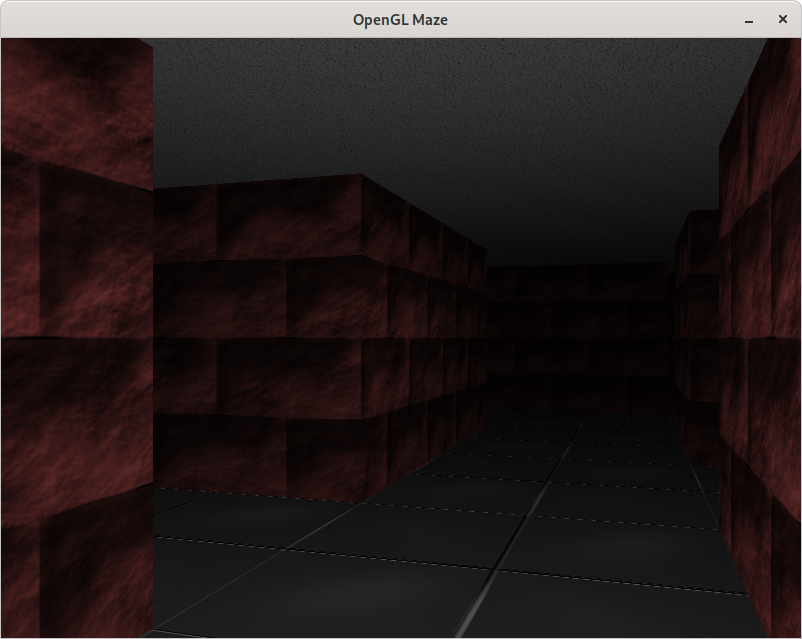

# glMaze
This is a simple OpenGL game that I wrote after completing first step of the learnopengl.com online book. It's a very simple 3D game where player starts in maze and needs to find exit in randomly generated (Depth-first search algorithm) perfect maze. It's implemented using OpenGL, SDL2 and GLAD libraries.

<span style="display:block;text-align:center">

## Installation guide

### 1. Install SDL2 with SDL_image and OpenGL development libraries

### 2. Clone repository with command
```console
$ git clone https://github.com/DragonSWDev/glMaze && cd glMaze
```

### 3. Build
```console
make
```

### 4. Run
```console
./glmaze
```
#### Note: "assets" and "shaders" directory needs to be present in same directory as exectuable.

## Manual
### Configuration options
Configurations is specified by command line arguments. Options can be specified in any order and count.

**-width=value** - Window width

**-height=value** - Window height
#### Note: This values are respected only if game works in windowed mode. In fullscreen mode game always set desktop resolution. With custom window size both values (width and height) needs to be specified and height can't be bigger than width. Default size is 800x600.

**-size=value** - Maze size (Default 20)

**-disable-collisions** - Disable collisions

**-fullscreen** - Run in fullscreen mode

### Optimizations
Since it's my first "serious" OpenGL application there are still things to optimize and improve. It has very basic collision system which can work better (e.g. wall sliding is not possible so movement is not perfect). I've performed some optimizations like not rendering walls which player will never be able to see but still entire maze is rendered so performance is not very good with big mazes. It can be definitely improved

### License
glMaze is distributed under MIT License (see LICENSE file for more informations). Project is using SDL2, SDL_image and GLAD. For informations about these libraries licensing see their respective websites. Assets are made by me and distributed under CC BY 4.0 license. See details here: https://creativecommons.org/licenses/by/4.0/
